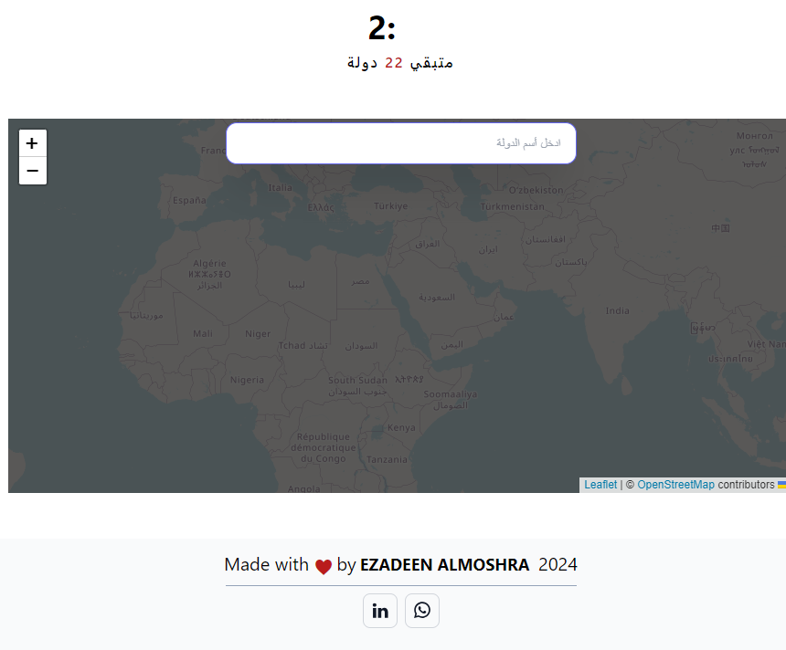

<p align="center">
  
</p>

<h1 align="center">Arab-countries-maps</h1>

<p align="center">
   Demo: <a href="https://ezadeen-almoshra.github.io/arab-countries-maps/" target="_blank">arab-countries-maps</a>
</p>

## 1. Installation

**1. Clone the repository:**

```bash
git clone https://github.com/Ezadeen-Almoshra/arab-countries-maps.git
```

**2. Install dependencies:**

```bash
npm install
```

**3. Start the development server:**

```bash
npm run dev
```


## 3. Technologies Used

- [Progressive Web App (PWA)](https://vite-pwa-org.netlify.app) for web app features

- [React js](https://react.dev) 

- [sweetalert2](https://www.npmjs.com/package/sweetalert2)

- [leaflet , react-leaflet](https://www)  Map

- [react-confetti]() 

## 4. Important websites

- [nominatim.openstreetmap.org](https://nominatim.openstreetmap.org/ui/search.html) For get geojson 	boundary for any country or city 
- [polygons.openstreetmap](http://polygons.openstreetmap.fr/index.py) For get geojson 	boundary for any country or city 

- [geojson.io](https://geojson.io/#map=13.16/24.70765/46.84555) For  draw boundary for any place


